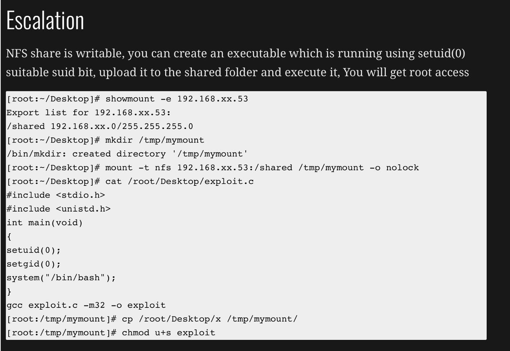

# NFS & RPC

> Remote Procedure Call - designed to allow computers to run tasks on each other	

## [135,msrpc]	

**Links**

https://en.wikipedia.org/wiki/Microsoft_RPC	
http://etutorials.org/Networking/network+security+assessment/Chapter+9.+Assessing+Windows+Networking+Services/9.2+Microsoft+RPC+Services/

`nmap -T4 -n -Pn -sV --version-all -p 135 --script="(default or vuln or exploit) and not (brute or dos or external)" 10.11.1.5`	
`nmap -T4 -n -Pn -sV --version-all -p {port} --script="msrpc-enum,rpc-grind, rpcinfo, freevulnsearch" {ip}`	

`rpcclient --user="" --command=enumprivs -N $ip`

`rpcclient -p 135 -U "" 10.11.1.5`

`rpc -N -U "" 10.11.1.5`

## [RPC - Port 111]

`rpcinfo -p 192.x.x.x`

`nmap -sV --script=nfs-ls 192.168.44.133`

`nmap --script="freevulnsearch,rpc-grind,rpcinfo,default" 192.168.100.131 -p 111`

**Connect to an RPC share without a username and password and enumerate privledges**

`rpcclient --user="" --command=enumprivs -N $ip`

**Connect to an RPC share with a username and enumerate privledges**

`rpcclient --user="<Username>" --command=enumprivs $ip`	
	

**Copy bash to a new subshell**

- mount a NFS share from a remote server, copy bash from local to remote and execute

- `cp -p ./bash /mnt/share/newbash`

- .`/newbash -p`

## [NFS - PORT 2049]

All NFS scripts [ls,showmount and statfs]

`nmap -sT -sU -sV [-p 111,2049] --script="nfs-*" 192.168.1.100`	
`nmap {nmap_extra} -sV -p {port} --script="(rpcinfo or nfs*) and not (brute or broadcast or dos or external or fuzzer)"`	
	
`nmap -sV --script=nfs-ls 192.168.44.133`  - same result as rpcinfo	
`showmount -e 192.168.100.131`	- Shows available exports from the given host.
`rpcinfo -p 192.168.100.131`	
	

**If you see any NFS related ACL port open**

see `/etc/exports`	

2049/tcp  nfs_acl	

/etc/exports: the access control list for filesystems which may be exported to NFS clients.	

https://www.techopedia.com/definition/1867/common-internet-file-system-cifs

Mount Windows CIFS / SMB share on Linux at /mnt/cifs if you remove password it will prompt on the CLI (more secure as it wont end up in bash_history)

- `net use Z: \\win-server\share password` 

- `/user:domain\janedoe /savecred /p:no`

Mount a Windows share on Windows from the command line

`apt-get install smb4k -y`

**READ:**	
https://pentestlab.blog/tag/rpc/	

See root squashing	
https://haiderm.com/linux-privilege-escalation-using-weak-nfs-permissions/	
	

## Mounting File Shares	

**How to mount NFS / CIFS, Windows and Linux file shares.**	

`sudo apt install nfs-common`	
`mount -t nfs 192.168.100.131:/ /mnt/nfs -o nolock`	
`mount -t nfs -o vers=2 10.10.10.127:/home /mnt`	

> Ippsec fortune video

**Check to see if package cifs-utils is installed:** 	

`dpkg -l cifs-utils`	
`sudo apt install cifs-utils`	
`mount -t cifs -o username=user,password=pass,domain=blah` ////192.168.1.X//share-name /mnt/cifs	
`mount -t cifs -o rw,guest "//host/share" /mnt/localdir`	how to mount a samba share anonymously

