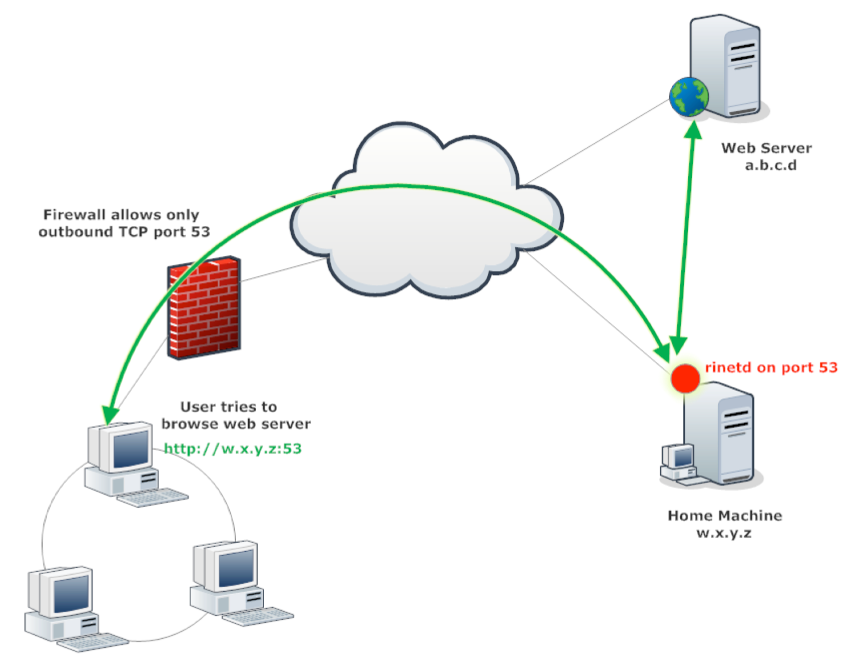

# Pivoting and Tunneling

**Links**

- Proxychains: https://github.com/haad/proxychains
- Proxychains-ng: https://github.com/rofl0r/proxychains-ng
- SSHuttle (Totally Recommend learning this): https://github.com/sshuttle/sshuttle
- SSHuttle Documentation: https://sshuttle.readthedocs.io/en/stable/

## SSH General

`systemctl start ssh` - `systemctl enable ssh`
`netstat -antp | grep sshd`

Speeding up Proxychains with Nmap / Xargs
https://www.hackwhackandsmack.com/?p=1021

---
## SSH Local Port Forwarding

Use in cases where your on a victim box and it has a port open only local ie; 127.0.0.1:3306 
so to make it available remotely we can port forward to this port from say 3305 with ssh. All the traffic sent to localhost's port 3305 will be forwarded to remote host on port 3306 through the tunnel.

- `ssh -L <local port to listen>:<remote  host>:<remote port> bob@sshserver.com` 
- `ssh -L 3305:pcathome:3306 bob@sshserver.com`

**To connect to your home PC through mysql (port 3306) in a secure way you will just use:**

`mysql localhost:3305`

https://unix.stackexchange.com/questions/10428/simple-way-to-create-a-tunnel-from-one-local-port-to-another
- `-g` means allow clients on the network to connect not just local clients
- `-N` means don’t start a shell just do port forwarding
- `-f` means make this a background process
doris@localhost is basically the user that will start this session so may need their creds

`ssh -g -L 3305:127.0.0.1:3306 -f -N doris@localhost`

**Plink [Windows SSH tool] - Local Port Forwarding**

Wir bauen einen SSH Tunnel um den MySQL zu erreichen. Wir müssen also über SSH einen Tunnel für Port 3306 schaffen. Dazu bauen wir eine SSH Verbindung zu 1.2.3.4 auf und Tunneln Port 3306.
- `plink.exe -v -pw geheim nutzername@1.2.3.4 -L 6603:localhost:3306`
- `plink.exe -v -pw mypassword gamma@10.11.0.192 -L 6666:127.0.0.1:445`